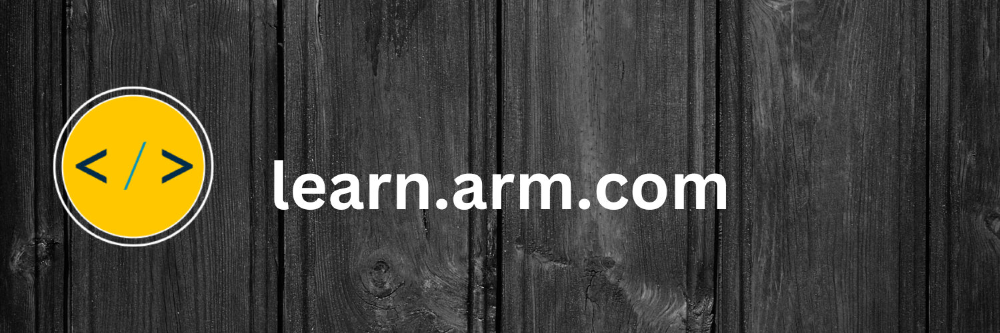

Hello, I currently work at [Arm](https://www.arm.com/) as a distinguished engineer. I'm also an [AWS Community Builder](https://aws.amazon.com/developer/community/community-builders/) promoting AWS Graviton processors.

My primary project on GitHub is [Arm Learning Paths](https://github.com/ArmDeveloperEcosystem/arm-learning-paths). Check it out if you want to learn more about software development on Arm or want to share what you know about developing on Arm.

You can also check my recent book [The Insider’s Guide to Arm Cortex-M Development](https://www.packtpub.com/product/the-insiders-guide-to-arm-cortex-m-development/9781803231112) and the associated [GitHub repository](https://github.com/PacktPublishing/The-Insiders-Guide-to-Arm-Cortex-M-Development).

